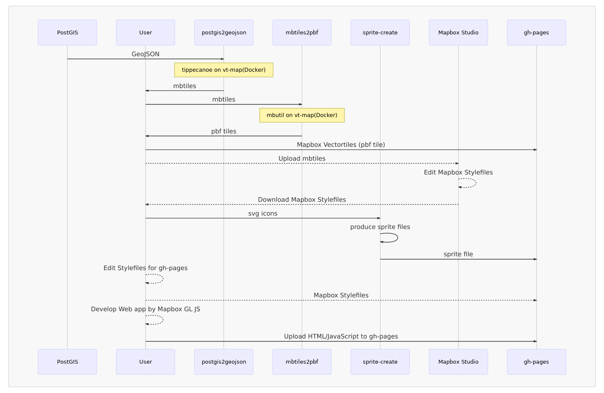

# awesome-narok-vector-tiles
This is awesome implementations of the Mapbox Vector Tile for Narok Water

## Procedures
The procedures of creating vector tile map could be as follows.

## 1. Create mbtiles from PostGIS
- [postgis2geojson](https://github.com/narwassco/postgis2geojson) : This module will create `mbtiles` by GeoJSON data which is retrieved from `PostGIS`.

First of all, you need to make SQL queries for each layer on [config.js](https://github.com/narwassco/postgis2geojson/blob/master/config.js), so `postgis2geojson` tool will extract required data from PostGIS and a mbtiles will be created.

In the current setting, we have prepared following layers for `Narok Water and Sewerage Services Co., Ltd`.

|Layer|Geometry Type|Min Zoom|Max Zoom|Remarks|
|---|---|---|---|---|
|pipeline|LineString|10|18|It includes all the types of pipeline, but you may seperate by type of pipe such as main line or secondary line if necessary.|
|meter|Point|16|18|It only includes household connections.|
|flowmeter|Point|14|18|It only includes flow meters to cover wider range of zoom level than consumer meters.|
|valve|Point|15|18|eg. gate valve, sluice valve, air valve, non-return valve, etc.|
|firehydrant|Point|15|18|It's firehydrant layer|
|washout|Point|15|18|It's washout layer|
|tank|Polygon|13|18|Distribution tank layer as `Polygon`. However, you might need to change geometry type to `Point`|
|plant|Polygon|10|18|It incudes boundries of Water Treatment Plant and Water Intake|
|parcels|Polygon|16|18|It is polygon of parcels data which was provided by Narok town planning office.|
|parcels_annotation|Point|17|18|We seperated parcel number from other parcel data due to reducing the size of data.|
|village|Polygon|10|17|Narok water is zoning some area which is called `village`, you may change layer name for your company.|
|dma|Polygon|13|17|District Metered Area(DMA) for Non-Revenue Water Management|
|point_annotation|Point|10|18|We put all the annotation data here if we need to show some label.|

In Narok water, although we have a pumping station at the WTP, we don't have layer for pump. I know it is significant for a water company. So, you may need to add a layer for pumping station.

## 2. Design your Mapbox Style on Mapbox Studio
Next step is to design your own Mapbox Style on Mapbox Studio by using `mbtile` which was produced before.

You can use our [water-icons](https://github.com/narwassco/water-icons) for the purpose of designing your layers.

You may need to create an account of Mapbox Studio. Then, please keep your public accessToken as well. 

You can see official manual of Mapbox Studio [here](https://docs.mapbox.com/studio-manual/overview/).

## 3. Deploy Sprite files on gh-pages
- [sprite-create](https://github.com/narwassco/sprite-create) : This module will create sprite file from [mapbox/maki](https://github.com/mapbox/maki) icons and [water-icons](https://github.com/narwassco/water-icons) icons. The Spritefiles will be published on gh-pages of this repository.

    the following repositories manage our icons which are being used in our style files.
  - [water-icons](https://github.com/narwassco/water-icons) : It includes our own customized icon for water assets.
  - [mapbox-street-icons](https://github.com/narwassco/mapbox-street-icons) : It includes icons of Mapbox Street style and customized `water-icons`.
  - [mapbox-satellite-icons](https://github.com/narwassco/mapbox-satellite-icons):It includes icons of Mapbox Satellite style and customized `water-icons`.

## 3. Deploy Vector Tile to gh-pages
- [vt-map](https://github.com/narwassco/vt-map)
  This module will use the following submodules to create Mapbox Vector Tile for deployment to gh-pages.
  - [postgis2geojson](https://github.com/narwassco/postgis2geojson): It creates `mbtiles` from PostGIS.
  - [mbtiles2pbf](https://github.com/narwassco/mbtiles2pbf): It converts from `mbtiles` to `pbf(mvt)` tiles.

This module uses [tippecanoe](https://github.com/mapbox/tippecanoe) for producing mbtiles and uses [mbutil](https://github.com/mapbox/mbutil) to convert `mbtiles`. However, Narok water's GIS computer is Windows 10 Pro, so it is not easy to run `tippecanoe`, I developed `Docker` to create Mapbox Vector Tile.

## 4. Deploy Stylefiles to gh-pages
- [mapbox-stylefiles](https://github.com/narwassco/mapbox-stylefiles) : It manages our Mapbox Stylefiles. Those Stylefiles will be published on gh-pages of this repository.

When you edit your own stylefile, you may download it from Mapbox Studio, then you can delete unnecessary contents from the stylefile, and changed url of `vector tile` and `sprite file` on it.

After creating your own stylefiles, you can deploy them to gh-pages.

## 5. Develop and Deploy Web Application
- [mapbox-gl-js-client](https://github.com/narwassco/mapbox-gl-js-client) : It is an web application which is using [Mapbox GL JS](https://docs.mapbox.com/mapbox-gl-js/api/). 

We have already performed the website, so you just edit [config.js](https://github.com/narwassco/mapbox-gl-js-client/blob/master/src/config.js) and build the application. Eventually, deploy it to gh-pages. [This](https://narok.water-gis.com) is our vector tile application. Let me know if you have some ideas or feedbacks.

## 6. Update Vector Tile data on gh-pages frequently
I am still thinking how we can automate to update vector tile easily on daily-basis or weekly-basis. Now I think we may create some batch script to deploy them to gh-pages, then we use Windows Task Scheduler to launch it. 

---
Documented by Jin IGARASHI  
©Narok Water and Sewerage Services Co.,Ltd.
